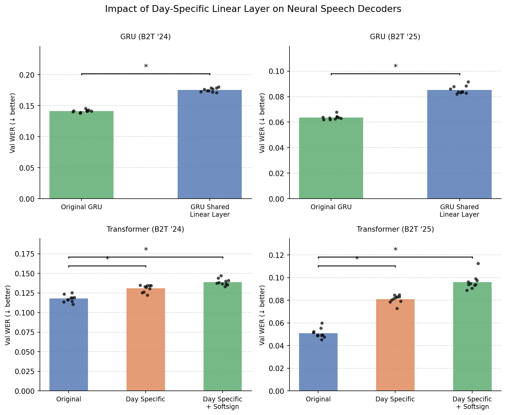

# Day-Specific Parameters — Hypothesis

**Date:** 2026-04-15

## Background
The Brain-to-Text '24 and '25 benchmarks contain data from two participants implanted with intracranial electrodes who are attempting to repeat text prompts displayed on a screen. The goal of the benchmarks is to develop algorithms to accurately decode the text given associated neural activity. The baseline algorithm, introduced by Willett et al. 2023, was a gated recurrent unit (GRU)-based encoder which converts neural activity to logits over phonemes. The GRU-based encoder was trained with connectionist temporal classification (CTC) loss. A CTC decoder then converts these phoneme logits to word-level text through a language-model guided beam search process. 

The GRU-based encoder contains a day-specific input linear layer, followed by a softsign nonlinearitty. This day-specific layer was shown to improve performance (measured using word error rate, or WER), likely because it helps the GRU adapt to distribution shifts in neural activity across days. When ablating the day-specific linear layer and using a shared linear layer across days, Willett et al. reported a significant performance decrease. 

In a recent study, Feghhi et al. 2025 introduced the time-masked Transformer CTC encoder for neural speech decoding. This encoder was a Vision-Style (ViT) causal Transformer trained with high amounts of time-masking augmentation. This causal Transformer performed significantly better than the unidirectional GRU encoder and on-par with the bidirectional GRU encoder, despite being significantly smaller. Interestingly, adding a day-specific linear layer did not improve performance on the validation set, and in fact hurt generalization for the Transformer-based encoder. Performance was slightly better when not including the softsign nonlinearity, but still remained worse relative to the setting when no day-specific layer was included. 

Your research task is to gain insights into why the Transformer encoder does not need day-specific parameters for neural speech decoding. Given that there are several differences between the Transformer and GRU encoder, there are many hypotheses to explore. For instance, Feghhi et al. 2025 hypothesized that layer normalization layers in the patch embedding module may normalize the input neural activity into a common space such that day-specific parameters are no longer necessary. 

In order to more formally define this problem, let us define the components that are involved in converting neural activity into text. First, we have the data representation. For both benchmarks, threshold crossings and spike binned power are extracted for each microelectrode channel. For B2T '24, there are 256 features (2 features per 128 electrodes), and for B2T '25 there are 512 features (2 features per 256 electrodes). For B2T '24, neural activity is log-transformed, and then for both benchmarks the features are z-scored within blocks (typically consisting of 10-20 trials). The data representation is identical for the GRU and Transformer encoder.

Next, we have the architecture. The Transformer architecture consists of a patch embedding module, which first divides the neural activity into non-overlapping 1D patches (n_samples_per_patch*n_features), and then passes this activity through a sequence of layer norm, linear, layer norm. The activity is then passed through K Transformer layers, consisting of a FFN with a layernorm layer and a self-attention layer. The final output is projected into the phoneme logit space. The GRU architecture consists of a day specific linear layer, followed by a softsign non-linearity. Neural activity is then partitioned into overlapping patches, and fed into the GRU network which has L layers. The output is then projected into the phoneme logit space. 

Third are augmentations. Both encoders are trained with an additive white noise augmentation and a baseline shift augmentation. The Transformer and the GRU for B2T '25 also employ input dropout, and notably the Transformer utilizes large amounts of time masking augmentation. Fourth is the training recipe. The GRU for B2T '24 is trained with Adam with no learning rate scheduler, whereas the Transformer and GRU for B2T' 25 are trained with AdamW with a learnign rate scheduler (step decay for Transformer, cosine scheduler for GRU). The Adam optimizers for the GRU use high values for epsilon.

Fifth, both encoders use the same CTC decoder (Feghhi et al., 2026). The decoder hyperparameters were tuned using the GRU encoders for B2T '24 and '25 individually, and are frozen for all other encoder setups. Finally, the same evaluation metric (phoneme error rate, PER, and WER) are used for both encoders.

## Observation

## Hypothesis

Adding day-specific parameters is expected to **not significantly improve** performance for the time-masked Transformer, but is expected to **significantly improve** performance for GRU-based encoders.

## Rationale

To be filled in.

## Experiments

| Model | Day-Specific | Expected Effect |
|-------|-------------|-----------------|
| Time-masked Transformer | Yes | No significant improvement |
| GRU-based encoder | Yes | Significant improvement |

## Results

