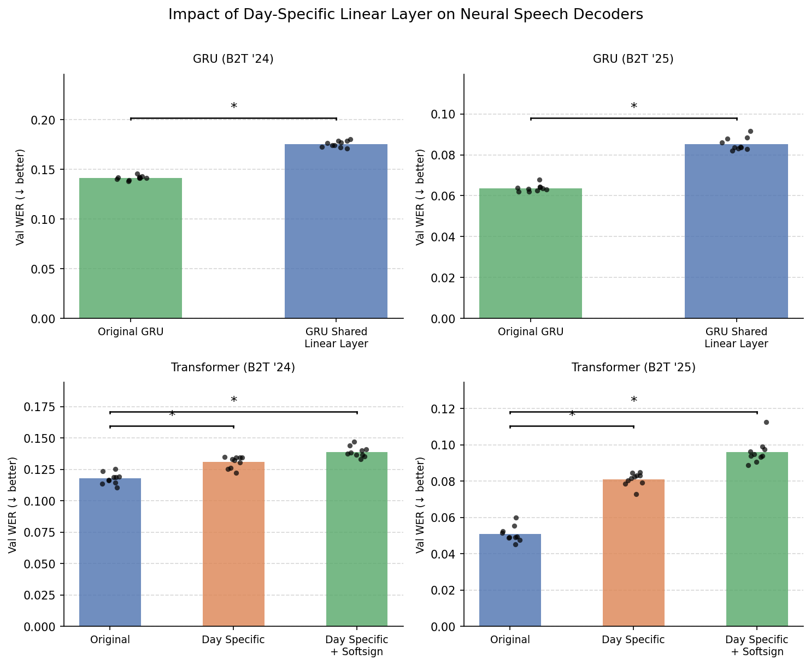
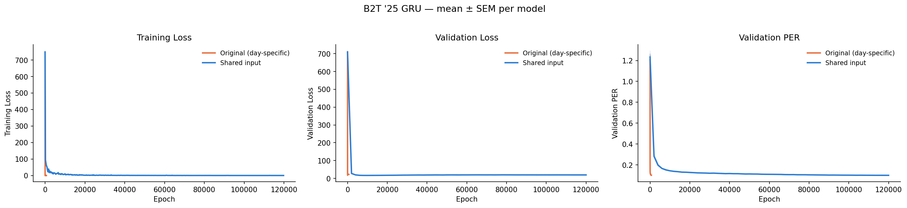
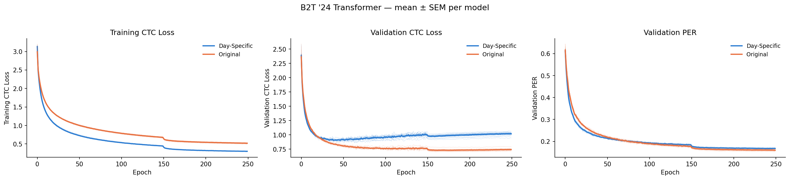
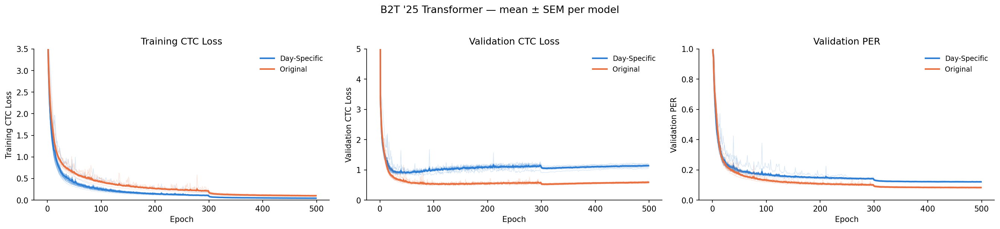

# Day-Specific Parameters — Hypothesis

**Date:** 2026-04-15

## Background

The Brain-to-Text (B2T) '24 and '25 benchmarks contain data from two participants implanted with intracranial electrodes who attempted to repeat text prompts displayed on a screen. The goal of each benchmark is to accurately decode the spoken text from associated neural activity.

The baseline algorithm for both benchmarks uses a [GRU](../../../src/brainaudio/models/gru.py)-based encoder that converts neural activity into logits over phonemes, trained with connectionist temporal classification (CTC) loss. A CTC decoder then converts these phoneme logits to word-level text via a language-model-guided beam search. A key feature of the GRU encoder is a **day-specific input linear layer**: a separate affine transform per recording session, followed by a Softsign nonlinearity, which adapts to day-to-day distribution shifts in neural activity. All other GRU parameters are shared across days. Baseline GRU configs: [B2T '24](../../../src/brainaudio/training/utils/custom_configs/gru_b2t_24_baseline.yaml) | [B2T '25](../../../src/brainaudio/training/utils/custom_configs/gru_b2t_25_baseline.yaml).

More recently, a Vision-Transformer-style [Transformer](../../../src/brainaudio/models/transformer_chunking.py) encoder trained with heavy time-masking augmentation was shown to outperform the GRU baseline on both benchmarks. Notably, the Transformer encoder uses **no day-specific parameters** — all weights are shared across recording sessions. Baseline Transformer configs: [B2T '24](../../../src/brainaudio/training/utils/custom_configs/neurips_b2t_24_chunked_transformer.yaml) | [B2T '25](../../../src/brainaudio/training/utils/custom_configs/neurips_b2t_25_chunked_transformer.yaml).

## Observation

Adding day-specific parameters **hurts** the Transformer and removing them **hurts** the GRU, on both benchmarks (Figure 1).

- **GRU with shared input layer** (Figure 1, top left / top right): replacing the day-specific input transform with a single shared layer significantly increases WER on both B2T '24 and B2T '25. Configs: [B2T '24](../../../src/brainaudio/training/utils/custom_configs/day_param_configs/gru_b2t_24_shared_input.yaml) | [B2T '25](../../../src/brainaudio/training/utils/custom_configs/day_param_configs/gru_b2t_25_shared_input.yaml).

- **Transformer with day-specific layer** (Figure 1, bottom left / bottom right): adding a day-specific affine transform to the Transformer significantly increases WER on both benchmarks. Adding a Softsign nonlinearity after the transform degrades performance further. Configs: [B2T '24](../../../src/brainaudio/training/utils/custom_configs/day_param_configs/transformer_b2t_24_day_specific.yaml) | [B2T '24 + Softsign](../../../src/brainaudio/training/utils/custom_configs/day_param_configs/transformer_b2t_24_day_specific_softsign.yaml) | [B2T '25](../../../src/brainaudio/training/utils/custom_configs/day_param_configs/transformer_b2t_25_day_specific.yaml) | [B2T '25 + Softsign](../../../src/brainaudio/training/utils/custom_configs/day_param_configs/transformer_b2t_25_day_specific_softsign.yaml).

## Research Question

Why does the Transformer not require day-specific parameters, whereas the GRU does? Specifically, what components of the Transformer architecture or training process are important for its ability to perform well without day-specific parameters? 

The goal of this research is to isolate the minimal set of components that enable training effectively without day-specific parameters? 

## Research Plan

For the remainder of this document, we will refer to the GRU encoder as the Day-Specific encoder, and the Transformer encoder as the Day-Invariant encoder. 

1) Document the differences between the Day-Specific and Day-Invariant encoders other than the fact that the day-specific encoder has day-specific parameters (model architecture, data augmentations, optimizer, hyperparameters, regularization methods). Let 
2) Rank the differences according to how likely they are to be included in the minimal set of components.
3) Starting from most likely component, iteratively perform the following procedure: 
    a) Modify the Day-Specific encoder with the selected component (e.g. add time masking augmentation) and evaluate its WER.
    b) If WER is equal to or better than the original day-specific encoder, continue to step (c), otherwise move on to the next component. 
    c) To evaluate whether this component obviates the need for day-specific parameters, train a Day-Invariant model that is identical to the model in step (a) without day-specific parameters and evaluate its WER.
    d) If the WER in step (c) is equal to or better than the WER in step (a), terminate and return the selected component. 

Issues with the current research plan.
1) Step (b) may fail simply because the hyperparameters of the day-specific encoder are not tuned taking into account the added selected component. For instance, when adding time-masking it is typically advised to lower other forms of regularization since time-masking itself is a strong form of regularization. This leads to additonal complexity. On a related note, the GRU with the shared layer may simply perform worse because hyperparameters were not tuned to take into account this change. For instance, it may simple be that the GRU underfits the data without the day-specific layer. This reminds me, we should compare the training and val losses.
2) 

## Results

**Figure 1.** Impact of day-specific input parameters on GRU and Transformer encoders across both benchmarks. All starred comparisons are statistically significant. Top row: GRU with and without the day-specific input layer ([B2T '24](day_specific_wer_b2t_24.png), [B2T '25](day_specific_wer_b2t_25.png)). Bottom row: Transformer with no day-specific params, day-specific layer, and day-specific layer + Softsign.

**Figure 2.** Training loss, validation loss, and validation PER for the B2T '25 GRU — Original (day-specific) vs. Shared input — across seeds (mean ± SEM).

**Figure 3.** Training CTC loss, validation CTC loss, and validation PER for the B2T '24 Transformer — Original vs. Day-Specific — across seeds (mean ± SEM).

**Figure 4.** Training CTC loss, validation CTC loss, and validation PER for the B2T '25 Transformer — Original vs. Day-Specific — across seeds (mean ± SEM).

## Experiment Log 

| Model | Dataset | Variant | Config |
|-------|---------|---------|--------|
| GRU | B2T '24 | Original (day-specific input) | [gru_b2t_24_baseline](../../../src/brainaudio/training/utils/custom_configs/gru_b2t_24_baseline.yaml) |
| GRU | B2T '24 | Shared input layer | [gru_b2t_24_shared_input](../../../src/brainaudio/training/utils/custom_configs/day_param_configs/gru_b2t_24_shared_input.yaml) |
| GRU | B2T '25 | Original (day-specific input) | [gru_b2t_25_baseline](../../../src/brainaudio/training/utils/custom_configs/gru_b2t_25_baseline.yaml) |
| GRU | B2T '25 | Shared input layer | [gru_b2t_25_shared_input](../../../src/brainaudio/training/utils/custom_configs/day_param_configs/gru_b2t_25_shared_input.yaml) |
| Transformer | B2T '24 | Original (no day-specific params) | [neurips_b2t_24_chunked_transformer](../../../src/brainaudio/training/utils/custom_configs/neurips_b2t_24_chunked_transformer.yaml) |
| Transformer | B2T '24 | Day-specific layer | [transformer_b2t_24_day_specific](../../../src/brainaudio/training/utils/custom_configs/day_param_configs/transformer_b2t_24_day_specific.yaml) |
| Transformer | B2T '24 | Day-specific layer + Softsign | [transformer_b2t_24_day_specific_softsign](../../../src/brainaudio/training/utils/custom_configs/day_param_configs/transformer_b2t_24_day_specific_softsign.yaml) |
| Transformer | B2T '25 | Original (no day-specific params) | [neurips_b2t_25_chunked_transformer](../../../src/brainaudio/training/utils/custom_configs/neurips_b2t_25_chunked_transformer.yaml) |
| Transformer | B2T '25 | Day-specific layer | [transformer_b2t_25_day_specific](../../../src/brainaudio/training/utils/custom_configs/day_param_configs/transformer_b2t_25_day_specific.yaml) |
| Transformer | B2T '25 | Day-specific layer + Softsign | [transformer_b2t_25_day_specific_softsign](../../../src/brainaudio/training/utils/custom_configs/day_param_configs/transformer_b2t_25_day_specific_softsign.yaml) |
