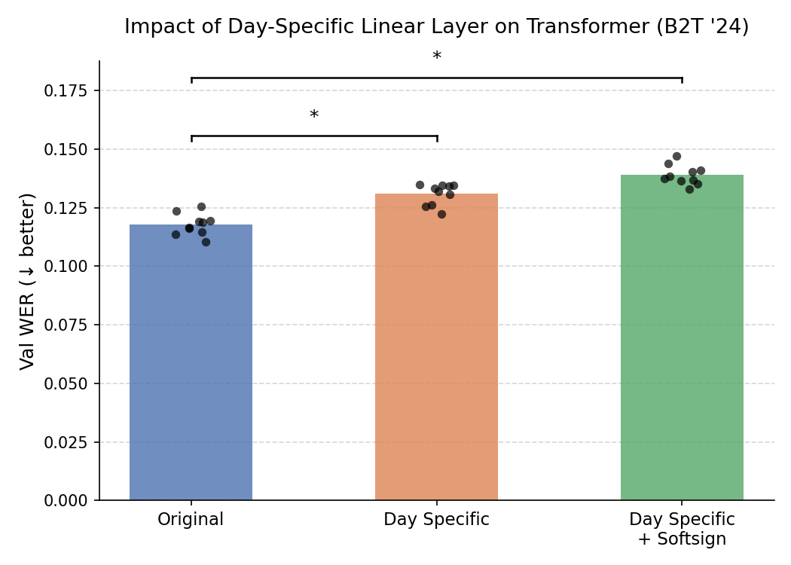

# Day-Specific Parameters — Hypothesis

**Date:** 2026-04-15

## Hypothesis

Adding day-specific parameters is expected to **not significantly improve** performance for the time-masked Transformer, but is expected to **significantly improve** performance for GRU-based encoders.

## Rationale

To be filled in.

## Experiments

| Model | Day-Specific | Expected Effect |
|-------|-------------|-----------------|
| Time-masked Transformer | Yes | No significant improvement |
| GRU-based encoder | Yes | Significant improvement |

## Results

