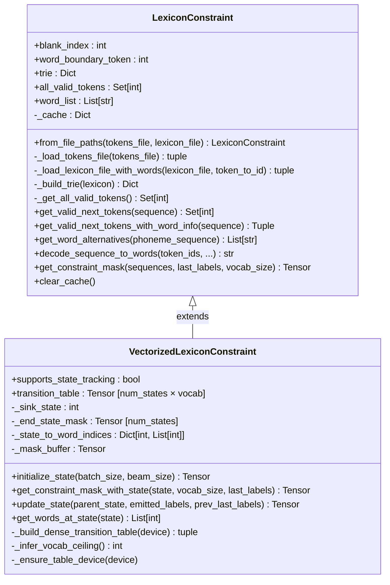
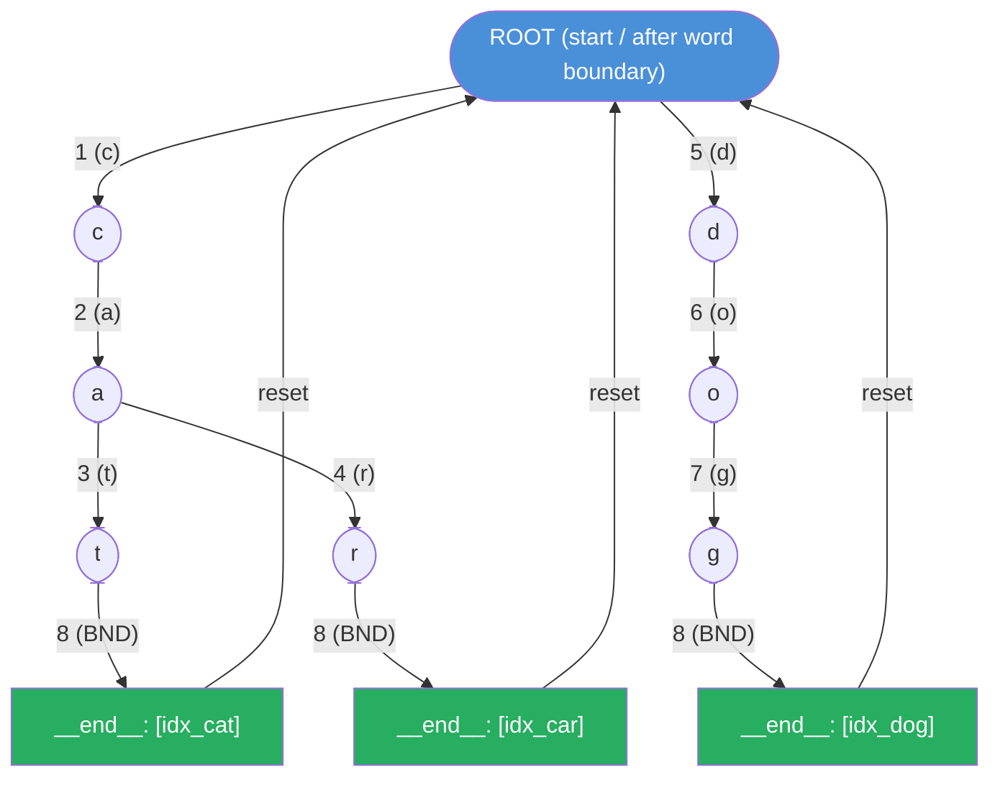
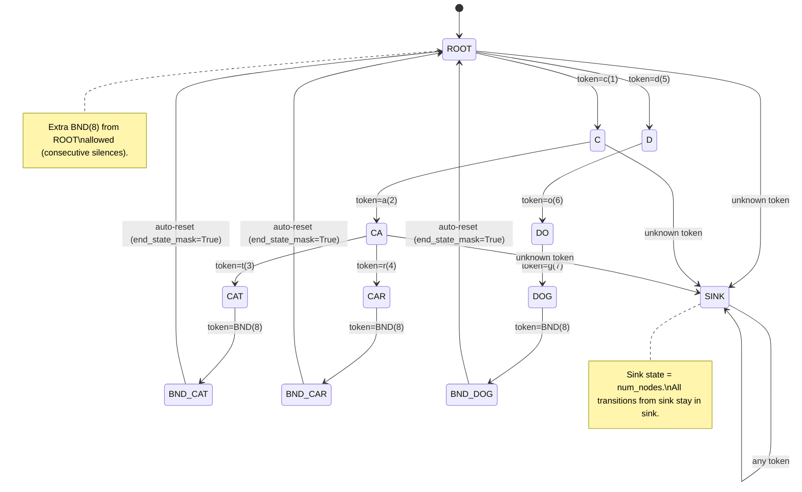
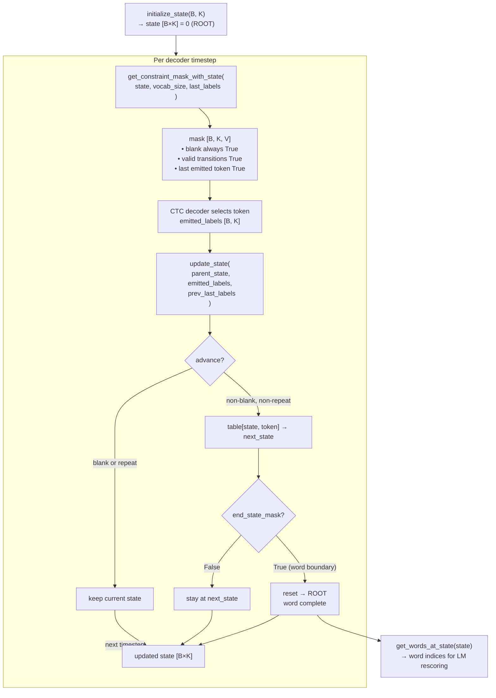
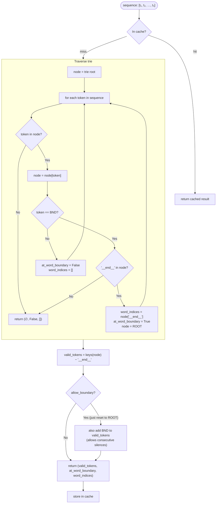

# LexiconConstraint Visual Diagrams

---

## 1. Class Hierarchy

---

## 2. Trie Structure (Example: "cat", "car", "dog")

Token IDs: `c=1, a=2, t=3, r=4, d=5, o=6, g=7, |=8`

> **`__end__`** nodes store a list of word indices — multiple indices indicate homophones
> (e.g., "aunt" and "ant" sharing the same phoneme sequence).
> After a word boundary token, the traversal resets to ROOT to begin the next word.

---

## 3. VectorizedLexiconConstraint: Compiled DFA States

The trie is BFS-enumerated into integer states and compiled into a dense `transition_table[state, token] → next_state`.

---

## 4. Beam Search Runtime Data Flow (VectorizedLexiconConstraint)

---

## 5. `get_valid_next_tokens_with_word_info` Logic

